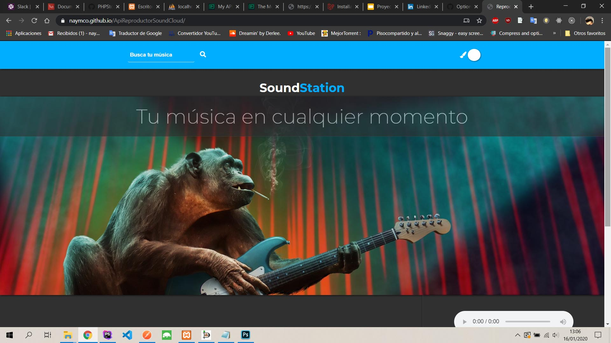
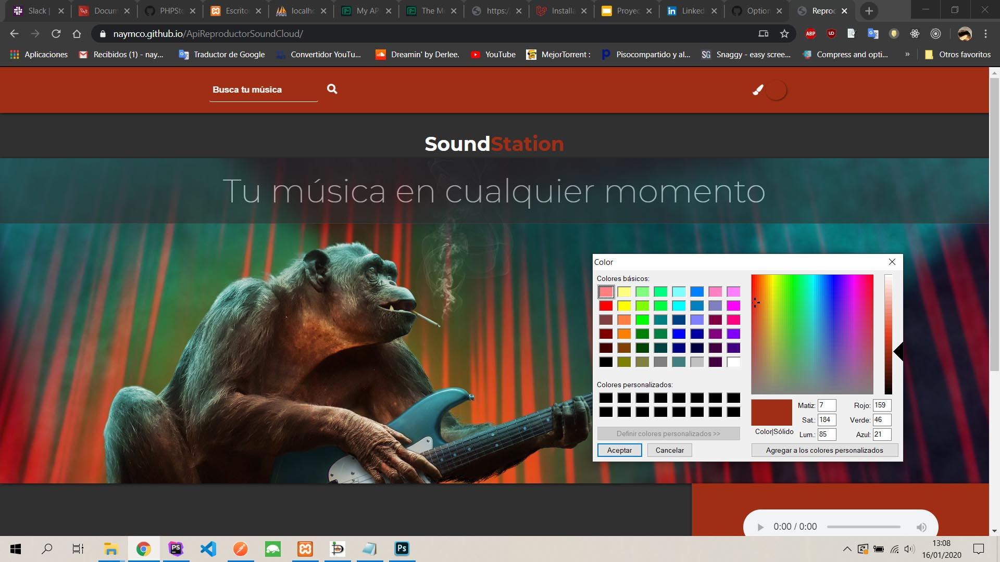
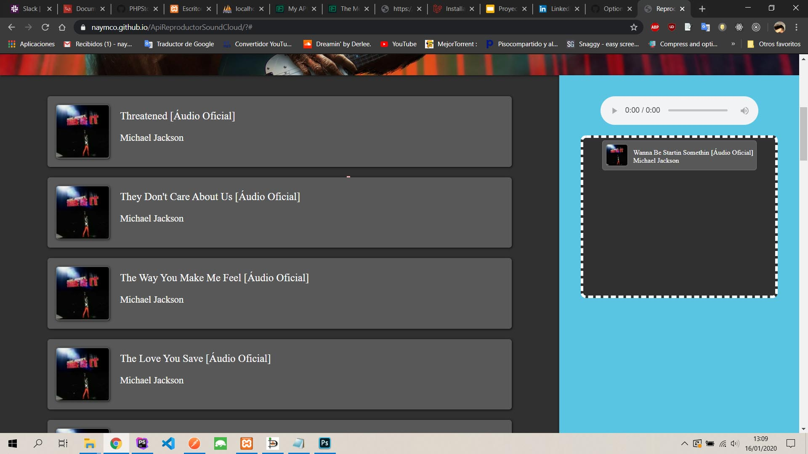

# ApiReproductorSoundCloud
Reproductor de SoundCloud para el proyecto de GeeksHubs.

######################

Aplicación con un reproductor de música. Obtuve la información de la api de SoundCloud y creé un buscador de canciones
que puedes escuchar mientras sigues navegando y buscando otros artistas. 

######################

## Screenshots
Pantalla principal

Selección de color de la aplicación personalizado

Vista del drag and drop de las canciones

Todo el proyecto se presenta en una sola hoja de HTML, y utilicé Javascript, también usé diferentes tipos de efectos
visuales en JQuery que creí que se verían bien además de agregarle más funcionalidad.

Usé CSS puro, con flex lo cual me facilitó mucho el diseño al organizar los elementos como quería.

######################

El proyecto me tomó bastantes horas porque no soy aún muy hábil en la lógica, así que intenté mejorarlo todo lo que pude 
en la parte de diseño en la que tengo algo más de conocimientos para intentar sacarle el mayor partido.
